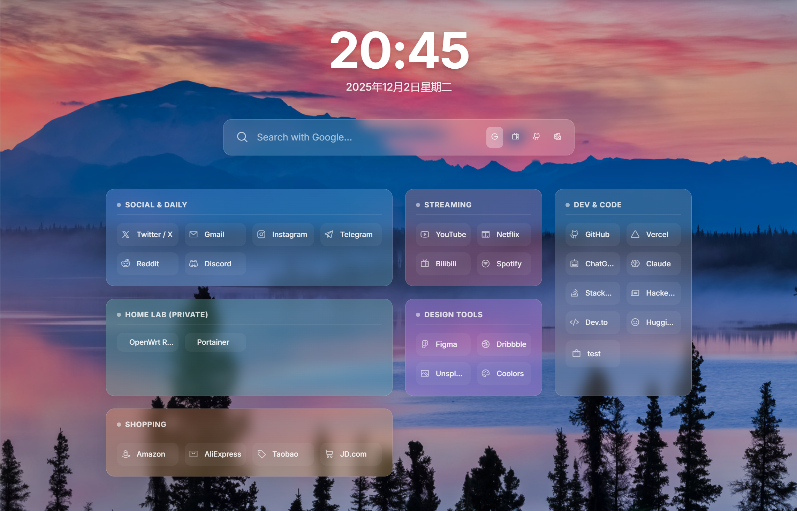

# Simple Start Page

> 一个极简但不失质感的浏览器起始页 / Chrome 扩展。支持拖拽卡片、双链接切换、随机壁纸、YAML 配置以及 GitHub Gist 远程同步，让你的所有设备保持同样的导航体验。



## ✨ 功能特点

- **即时可视化布局**：玻璃拟态 + 大幅时间面板 + 可调网格，卡片支持拖拽排序、隐藏/显示、横向跨列 (`colSpan`) 与纵向跨行 (`rowSpan`)。
- **敏捷的编辑体验**：点击页脚 `Edit` 进入编辑态，在浮层里新增或编辑分类 / 书签，支持 `url_private` 字段实现内外网一键切换，以及 `hidden` 字段做个人收藏。
- **可编排的搜索框**：可定义多个搜索引擎（名称、请求地址和图标），点击图标即时切换，回车即在新标签页打开结果。
- **随机壁纸与图标粗细**：右下角按钮可获取 Bing 每日高清图并缓存到 `localStorage`；设置面板内可在 Phosphor 图标六种字重之间切换以匹配个人审美。
- **YAML 配置 & 远程同步**：内置 `nav.yaml` 示例，可在页面中直接导入 / 导出；通过 GitHub Gist `Test / Pull / Push` 按钮即可多端共享配置。
- **MV3 扩展就绪**：`manifest.json` 将新标签页指向 `index.html`，所有依赖（Phosphor Icons、Sortable、js-yaml）都打包在 `vendor/` 中，满足 Chrome 扩展 CSP。
- **本地 / 远程状态感知**：页脚展示数据来源（默认数据、本地缓存、Gist 拉取）与 Bing 图片版权，方便排查。

## 🚀 快速开始

### 1. 克隆仓库并构建样式

```bash
git clone https://github.com/rapporbit/simple-start-page.git
cd simple-start-page
npm install          # 安装 Tailwind / PostCSS
npm run build        # 重新生成 dist/app.css
```

执行完毕后直接在浏览器中打开 `index.html`，或部署到任意静态托管（Vercel、Netlify、GitHub Pages 等）。

### 2. 作为 Chrome 扩展加载

1. 运行 `npm run build:release`，脚本会清理旧产物、构建 CSS 并输出 `release-ext/` 以及压缩包。
2. 打开 `chrome://extensions`，启用开发者模式，选择 “加载已解压的扩展程序”，指向 `release-ext`（或整个仓库根目录）。
3. 新标签页会被替换成 Simple Start Page，扩展菜单中的 “选项” 入口会载入 `options.html`，方便在设置页面外管理 Gist。

### 3. 定制与部署

- 如果希望与团队共享，可将构建后的文件部署到静态服务器，同时在 `manifest.json` 里把 `homepage` 或覆盖地址改成你的域名。
- 项目无后端依赖，仅需任意 HTTP 服务即可。

## ⚙️ 配置与同步

### 本地可视化编辑

1. 页脚点击 `Edit` 进入编辑模式（顶部会出现绿色提示条）。
2. 通过 `+` 按钮新增分类或书签，表单支持名称、链接、图标、颜色、私有链接以及隐藏状态。
3. 拖动卡片左侧标题即可重新排序；拖动书签即可在同分类内排序。
4. 桌面端拖曳卡片右下角的 `resize` 手柄即可调整宽 / 高；移动端保持默认布局。
5. 完成后点击 `Done` 或点击空白处退出，所有改动都会写入 `localStorage (nav_config_cache)`。

### YAML 结构

- 根对象含 `search` 与 `categories`，示例见 `nav.yaml`。
- 搜索引擎字段：`name`、`url`（查询参数之前的地址）、`icon`（Phosphor 类名或单个字符）。
- 分类字段：`category`、`color`（Tailwind 渐变类）、`colSpan` 1~4、`rowSpan` 1~2、可选 `hidden`。
- 书签字段：`name`、`url`、`icon`、可选 `url_private`（切换内外网）、`hidden`。

```yaml
search:
  - name: Google
    url: https://www.google.com/search?q=
    icon: ph-google-logo

categories:
  - category: Dev & Code
    color: from-slate-600/20 to-zinc-600/20
    colSpan: 2
    rowSpan: 1
    items:
      - name: GitHub
        url: https://github.com
        icon: ph-github-logo
      - name: Portainer
        url: https://portainer.example.com
        url_private: http://192.168.1.10:9000
        icon: ph-docker-logo
```

### GitHub Gist 同步

1. 在 GitHub 创建公开或私有 Gist，添加文件 `nav.yaml`（或任意名称，只需与设置保持一致），粘贴上方 YAML。
2. 在页面页脚点击 `Settings` 打开弹窗，填入 Gist ID、文件名；如需访问私有 Gist 或执行 Push，请提供 `gist` scope 的 token（仅保存在本地）。
3. `Test` 验证连通性；`Pull` 将覆盖本地配置；`Push` 会把当前本地配置写回远程。
4. 弹窗内还可设置图标字重、拷贝配置、导入 YAML、查看最近 `Pull/Push` 时间或重置所有数据。
5. 作为扩展运行时也可在 `chrome://extensions` -> Simple Start Page -> 选项 中进行同样的配置。

### 导入 / 导出

- `Import Config`：在弹窗输入框粘贴 YAML，即可覆盖当前数据。
- `Copy Config`：将当前配置导出为 YAML，方便备份或粘贴到 Gist。
- 所有操作均依赖 `js-yaml` 在浏览器端解析 / 序列化，无需额外后端。

## 🧰 开发 & 构建脚本

| 命令 | 说明 |
| --- | --- |
| `npm run build` | 调用 `tailwindcss` 读取 `src/tw.css`，输出压缩后的 `dist/app.css`。 |
| `npm run build:css` | 单独构建 CSS（与 `build` 等价）。 |
| `npm run clean` | 清理 `dist/`、`release-ext/` 以及旧的 `release-ext-*.zip`。 |
| `npm run build:release` | 清理 + 构建 CSS + 拷贝静态资源到 `release-ext/` 并生成 zip，便于 Chrome 扩展商店或离线安装。 |

建议使用 Node.js 18+，以确保 Tailwind CLI 与脚本运行顺利。

## 📁 主要目录

```
simple-start-page/
├─ index.html            # 新标签页主界面
├─ options.html/js       # Chrome 扩展选项页
├─ css/                  # 自定义样式（含玻璃态、弹窗等）
├─ dist/app.css          # Tailwind 构建产物
├─ js/                   # 前端逻辑（配置、拖拽、壁纸、Gist 等模块化代码）
├─ vendor/               # 离线依赖（Phosphor Icons、Sortable、js-yaml）
├─ nav.yaml              # YAML 配置示例，建议复制到你的 Gist
├─ scripts/              # 构建 / 打包脚本
└─ manifest.json         # MV3 配置，覆盖 new tab & homepage
```

## 🧱 技术栈

- **Tailwind CSS**：负责 UI 构建，`tailwind.config.js` safelist 了动态拼接的类。
- **ES Modules + 原生 API**：全部逻辑在浏览器端完成，使用 `localStorage` 作为缓存。
- **Sortable.js**：提供编辑模式下的拖拽排序。
- **js-yaml**：在浏览器内解析 / 导出 YAML。
- **Phosphor Icons（本地化）**：提供六种字重的图标家族，通过 `phw-*` 类切换。
- **Bing 壁纸 API**：使用 `https://bing.biturl.top/` 获取每日背景。
- **GitHub Gist API**：通过 `fetch` 同步配置（`fetchGist` / `updateGist`）。

## 📝 License

项目采用 ISC 许可（见 `package.json`），可自由修改与分发，欢迎 issue / PR 贡献新特性。
